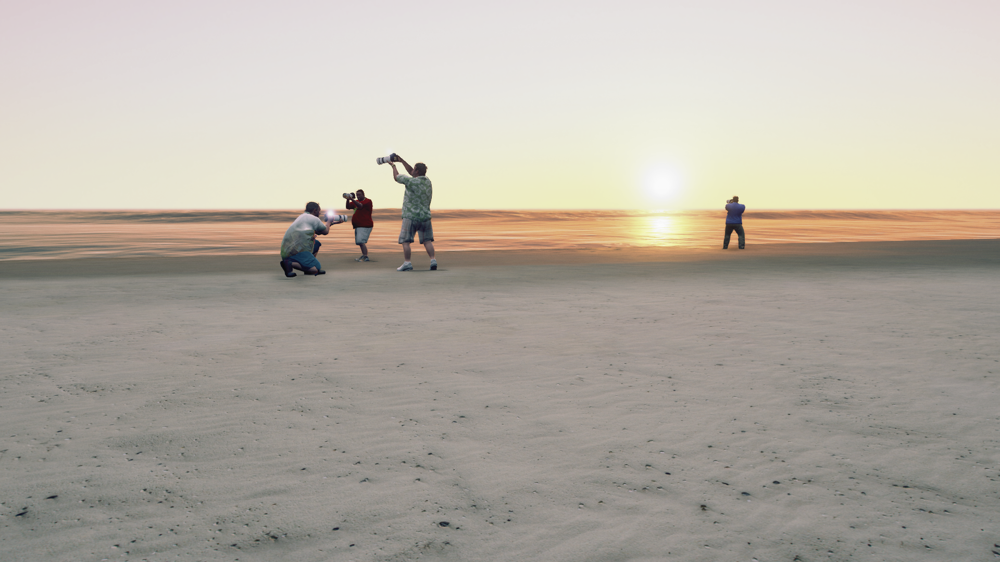

# Towards a Theory of the Photo Daddy
By 2girls1comp

A mod for GTA V that replaces all NPCs into photographers constantly snapping pictures.

ABOUT:
A mod that turns all NPCs into photo daddies and sets the time to a perpetual "golden hour". Quotes from Vilém Flusser's 1983 "Towards a Philosophy of Photography" are recited throughout the gameplay by a voice-over.

CINEMATIC TRAILER:
https://www.youtube.com/watch?v=Locfsrn2u6A

GAMEPLAY TRAILER: 
https://www.youtube.com/watch?v=vhiKpL8AlOg

INSTALLATION:
- Copy "towardsAPhilosophyOfThePhotoDaddy.dll" and the "flusser" folder into your scripts folder (if you don't have one, create it) in your GTA V root folder

INSTRUCTIONS:
- press L to toggle the mod ON/OFF
- the mod is not available during missions 

REQUIREMENTS:
Script Hook V
Script Hook V Dot Net

